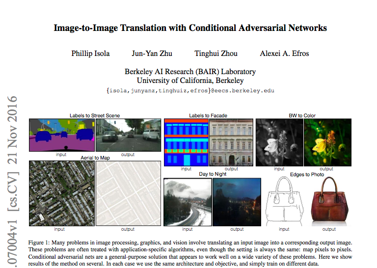
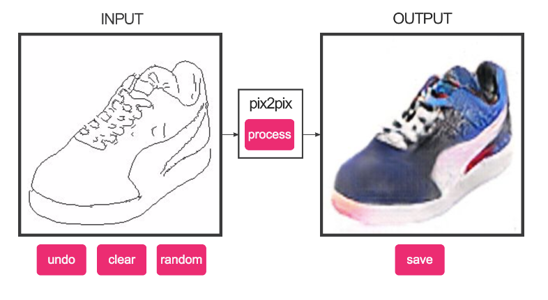
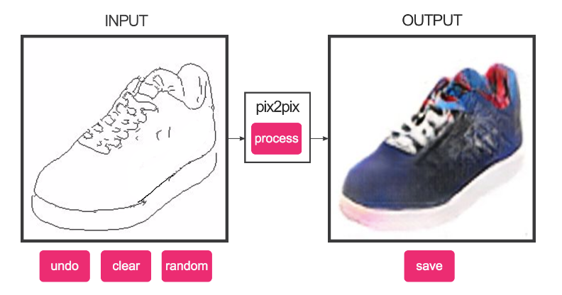
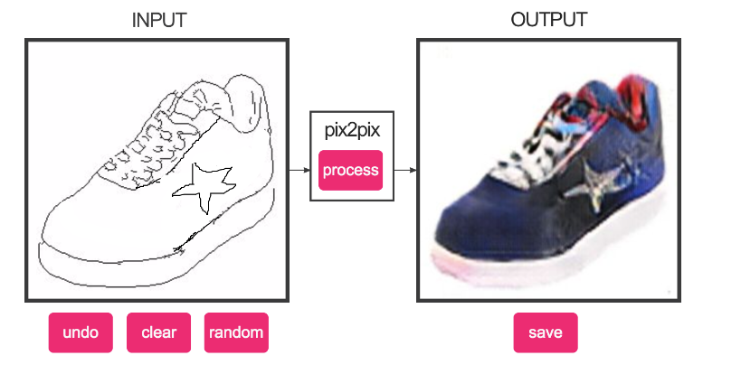
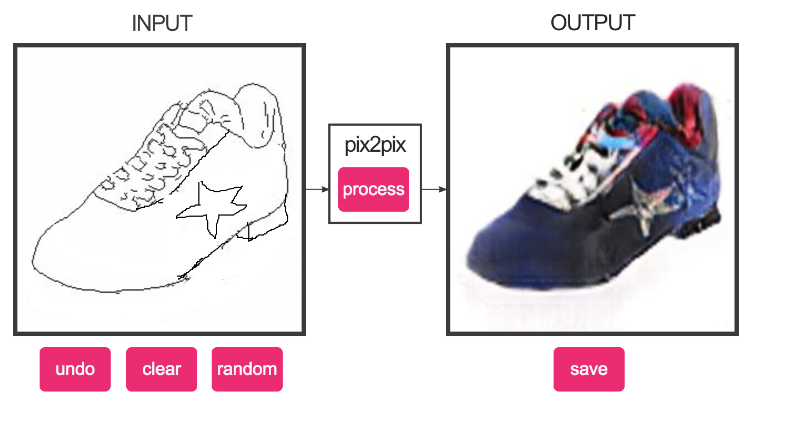
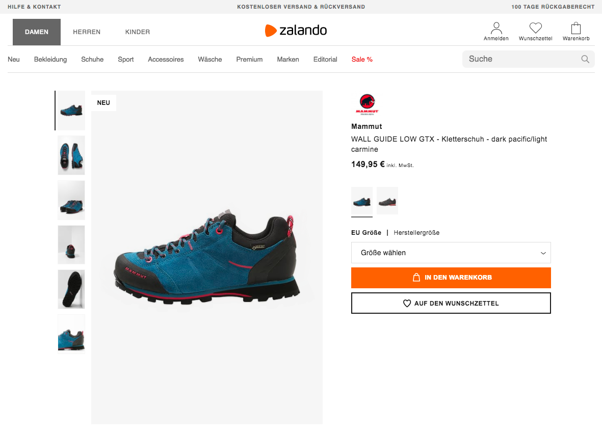
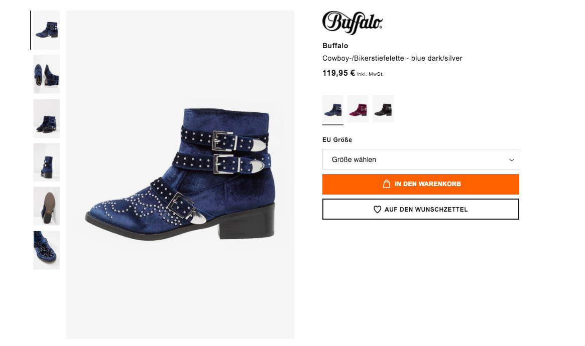

## Letting a user draw a fashion item

###  [Image-to-Image Translation with Conditional Adversarial Networks](https://arxiv.org/pdf/1611.07004v1.pdf)

### Change a fashion item we have seen in real life

Imagine we took a picture of a shoe, we have seen on the street. From there we can convert the color picture into contours or edges. Having edges we can provide user a tool to change a shape or style of item

For example, original shape and image generated by **Image-to-Image translation model**

On the picture, we have an original shape, received by processing a colored image with [Holistically-Nested Edge Detection](https://github.com/s9xie/hed). 

Now, a user can try to remove a white line on the shoe

As we can see our GAN-based model, generated a shoe, that looks pretty reasonable. Can we add a custom element?

Model also has generated an image, that incorporated a star on a side. What if we would like to go an extra step and also change an outsole and might add a heel

As we can see, the model also has incorporated the new shoe shape with a different outsole and heel.

### Find a real existing product using an API from Fashwell

Now, we can upload a picture to **Fashwell Posts API** and get a product, that has an image similar, to one that the user just had drawn. 

We got the next results:

And another one

As we can see, even with such a low resolution, Fashwell API can generate images. Might be also useful add a bit of focus on local patters, but the overall result is reasonable.

## References

* https://arxiv.org/pdf/1611.07004v1.pdf
* https://github.com/phillipi/pix2pix
* https://github.com/affinelayer/pix2pix-tensorflow
* https://github.com/s9xie/hed
* ​

